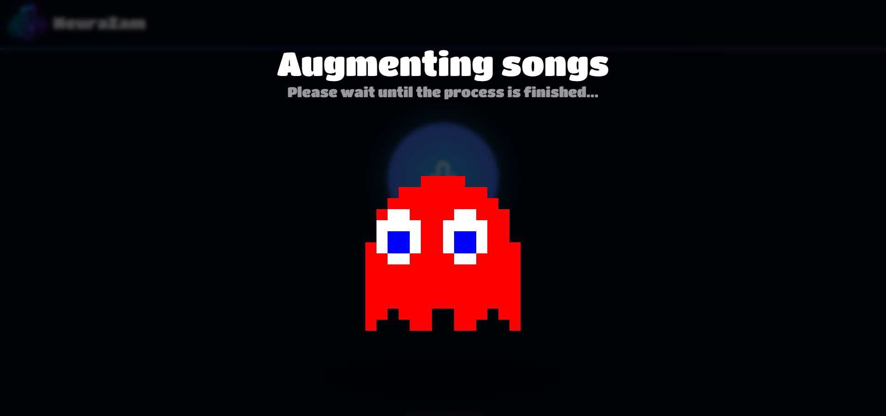
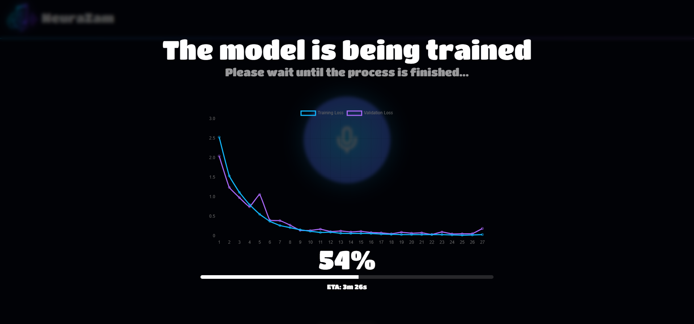
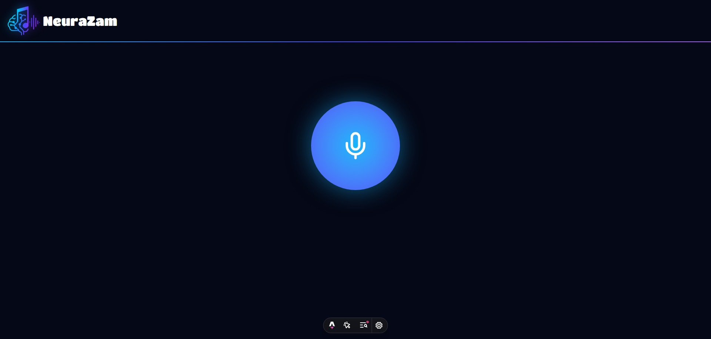
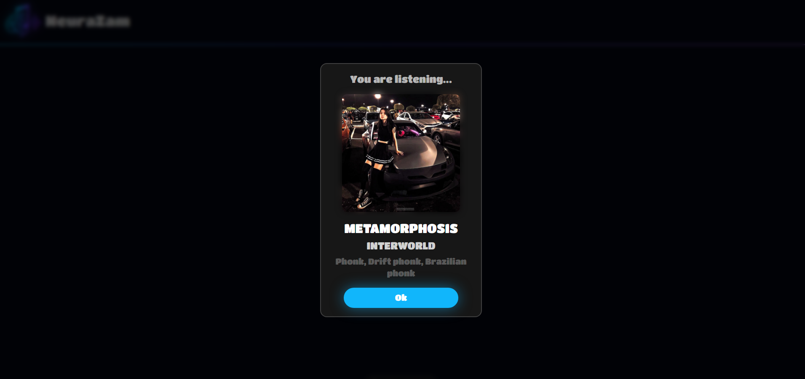

# NeuraZam

A real-time music detection system that uses convolutional neural networks to identify songs from live audio input through the user's microphone.

# Showcase

### Server State (Augmenting Data)


### Server State (Training Model)


### Frontend


### Model Predicting


## 🎵 Features

- **Real-time detection**: Identifies songs in 3-second segments
- **Machine Learning**: CNN trained on mel spectrograms for audio classification
- **Modern web interface**: Frontend built with Astro and TypeScript
- **Automatic download**: Spotify integration for playlist downloading
- **Data augmentation**: Improves model robustness with audio transformations
- **Real-time visualization**: Training progress charts with Chart.js

## 🏗️ System Architecture 

The system follows a client-server architecture with separate frontend and backend services communicating via WebSockets:

- **Frontend (Port 3000)**: Web interface with Astro, audio handling and WebSockets
- **Backend (Ports 5000, 5001)**: ML processing, model training and prediction
- **Communication**: WebSocket for model state (5000) and predictions (5001)

## 🚀 Quick Start

### Prerequisites

- Docker and Docker Compose
- NVIDIA GPU with CUDA support (recommended for training)
- `.env` file with Spotify configuration

### Installation

1. Clone the repository:
```bash
git clone https://github.com/moraxh/NeuraZam.git
cd NeuraZam
```

2. Configure environment variables:
```bash
cp .env.example .env
# Edit .env with your Spotify credentials
```

3. Run with Docker Compose:
```bash
docker-compose up --build
```

4. Access the application at `http://localhost:3000`

## 🧠 Machine Learning Pipeline

The system implements a complete ML pipeline:

1. **Audio download**: Retrieves songs from Spotify playlists using `spotdl`
2. **Feature extraction**: Converts audio to normalized mel spectrograms
3. **Data augmentation**: Applies transformations (noise, pitch shift, filters)
4. **CNN training**: Convolutional neural network with early stopping
5. **Real-time inference**: Live audio classification

### Performance in Testing

In internal tests, the model was successfully trained in **approximately 2 hours** using a dataset of **100 songs**, achieving **over 95% accuracy** in song identification.

### Model Architecture

- **Input**: Mel spectrograms (128 x time)
- **Layers**: 4 convolutional layers + 2 dense layers
- **Optimization**: Adam with ReduceLROnPlateau
- **Regularization**: Dropout, BatchNorm, Early Stopping

## 🎨 Frontend Components 

### Main Components

- **MusicDetector**: Main component for music detection
- **StateDialogManager**: Training state management
- **AudioRecorder**: Audio capture and processing
- **WebSocketManager**: Real-time communication
- **ChartManager**: Training metrics visualization

### Frontend Technologies

- **Astro 5.7.12**: Static site framework
- **TypeScript**: Static typing
- **TailwindCSS**: Utility-first styling
- **Chart.js**: Data visualization

## 🔧 Project Structure

```
NeuraZam/
├── app/
│   ├── frontend/          # Astro application
│   │   ├── src/
│   │   │   ├── components/    # Reusable components
│   │   │   ├── layouts/       # Page layouts
│   │   │   ├── lib/          # TypeScript utilities
│   │   │   └── pages/        # Application pages
│   │   └── Dockerfile
│   └── backend/           # Python server
│       ├── src/
│       │   ├── audio/        # Audio processing
│       │   ├── models/       # ML models
│       │   └── utils/        # Utilities
│       └── Dockerfile
├── docker-compose.yml     # Service orchestration
└── README.md
```

## 📊 System States 

The system manages multiple states during operation:

- `LOADING_SERVER`: Initializing server
- `DOWNLOADING_SONGS`: Downloading playlist
- `PROCESSING_SONGS`: Processing audio
- `EXTRACTING_FEATURES`: Generating spectrograms
- `TRAINING_MODEL`: Training CNN
- `READY`: Ready for predictions

## 🎯 Usage

1. **Initial setup**: System automatically downloads and processes songs
2. **Training**: CNN trains with processed data
3. **Detection**: Use listening button to identify songs in real-time
4. **Results**: View predictions with song information

## 🛠️ Development

### Useful Commands

```bash
# Frontend
pnpm install          # Install dependencies
pnpm dev             # Development server
pnpm build           # Production build

# Backend
python src/main.py   # Run backend server
```

### GPU Configuration

The system is optimized for NVIDIA GPU:
- CUDA-accelerated training
- Optimized real-time inference
- 2GB shared memory for processing

## 📝 License

This project is under the MIT License. See `LICENSE` for more details.

## 🙏 Acknowledgments

- **Spotdl**: For music access
- **PyTorch**: Deep learning framework
- **Astro**: Modern frontend framework
- **Chart.js**: Data visualization